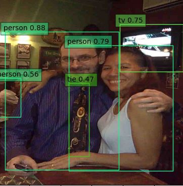
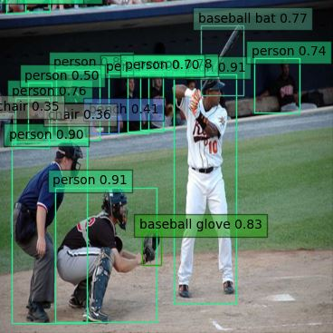
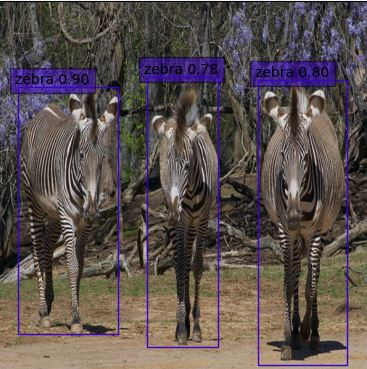
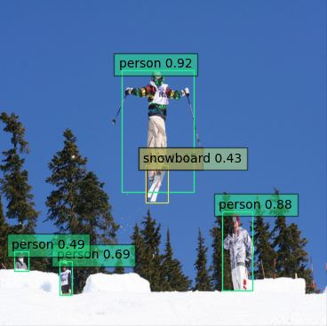

# Retinanet pytorch

re-implementation of Retinanet detection : https://arxiv.org/abs/1708.02002

### Setting

- Python 3.7
- Numpy
- pytorch >= 1.5.0 

### TODO List

- [x] Dataset
- [x] Model
- [x] Loss (Focal loss and smooth l1 loss)
- [x] Coder
- [x] Distributed training (distributed data parallel)

### Experiment
- [x] COCO 
- [ ] VOC 

COCO

- quantitative results

|methods     | Traning Dataset   |    Testing Dataset     | Resolution | AP        |AP50     |AP75    |Time | Fps  |
|------------|-------------------| ---------------------- | ---------- | --------- |---------|--------| ----| ---- |
|papers      | COCOtrain2017     |  COCO test-dev         | 600 x 600  |  34.0     |52.5     |36.5    |98   |10.20 |
|papers      | COCOtrain2017     |  COCOval2017(minival)  | 600 x 600  |  34.3     |53.2     |36.9    |98   |10.20 |
|ours        | COCOtrain2017     |  COCOval2017(minival)  | 600 x 600  |  31.9     |50.0     |34.0    |67   |14.85 |

<!-- |ours*       | COCOtrain2017     |  COCO test-dev         | 600 x 600  |**34.7**   |**53.6** |**37.3**|67   |14.85 | -->
<!-- |ours*       | COCOtrain2017     |  COCOval2017(minival)  | 600 x 600  |**34.7**   |**53.5** |**37.1**|67   |14.85 | -->

- qualitative results






### scheduler

- we use step LR scheduler scheme.

- whole training epoch is 13 and learning rate decay is at 9, 11

```
papers trained for 90k iterations with 16 batch.
when it comes to 1 epoch, number of training image(117266) / batch(16) = 7329.125 iterations (7.3k)
so 90k is about 13 epoch due to 7.3K * 13 = 94.9k 
and at 60k, 80k learning rate is divided by 10 to 1e-3, 1e-4

In this repo, for convinience of calculation to epochs, 
whole training epoch 13 (about 94.9k iterations)
learning rate decay at after 8 (65k), 11 (87k) epoch each

 paper     | this repo  | Learning Rate  
0k ~ 60K   | 0K ~ 65k   | 1e-2
60K ~ 80K  | 65k ~ 87k  | 1e-3
80K ~ 90K  | 87k ~ 95k  | 1e-4
``` 

<!-- - whole training epoch is 60 and learning rate decay is at 30, 45 -->

### training options

- batch : 16
- scheduler : step LR
- loss : focal loss and smooth l1 loss
- dataset : coco
- epoch : 13
- gpu : nvidia geforce rtx 3090 * 2EA
- lr : 1e-2

### training

- dataset

    train : trainval35k == train2017

    test : minval2014 == val2017

- data augmentation

    only use horizontal flipping same as papers.

- trained weight can get at [here](https://livecauac-my.sharepoint.com/:u:/g/personal/csm8167_cau_ac_kr/EUDJTzLdWyxNjoGfYapaGCUBwsrjK6R5yr77Uk4YnHubBw?e=nQRtMH)


<!-- 2. this repo uses data augmentation (random crop, expand, flip, photometric distortion, resize) refers to https://github.com/sgrvinod/a-PyTorch-Tutorial-to-Object-Detection/blob/master/utils.py -->

- results

    minival eval
    
```
Loading and preparing results...
DONE (t=5.93s)
creating index...
index created!
Running per image evaluation...
Evaluate annotation type *bbox*
DONE (t=67.32s).
Accumulating evaluation results...
DONE (t=13.30s).
 Average Precision  (AP) @[ IoU=0.50:0.95 | area=   all | maxDets=100 ] = 0.319
 Average Precision  (AP) @[ IoU=0.50      | area=   all | maxDets=100 ] = 0.500
 Average Precision  (AP) @[ IoU=0.75      | area=   all | maxDets=100 ] = 0.340
 Average Precision  (AP) @[ IoU=0.50:0.95 | area= small | maxDets=100 ] = 0.153
 Average Precision  (AP) @[ IoU=0.50:0.95 | area=medium | maxDets=100 ] = 0.357
 Average Precision  (AP) @[ IoU=0.50:0.95 | area= large | maxDets=100 ] = 0.462
 Average Recall     (AR) @[ IoU=0.50:0.95 | area=   all | maxDets=  1 ] = 0.285
 Average Recall     (AR) @[ IoU=0.50:0.95 | area=   all | maxDets= 10 ] = 0.458
 Average Recall     (AR) @[ IoU=0.50:0.95 | area=   all | maxDets=100 ] = 0.497
 Average Recall     (AR) @[ IoU=0.50:0.95 | area= small | maxDets=100 ] = 0.273
 Average Recall     (AR) @[ IoU=0.50:0.95 | area=medium | maxDets=100 ] = 0.564
 Average Recall     (AR) @[ IoU=0.50:0.95 | area= large | maxDets=100 ] = 0.682
0.3185735964212328
Eval Time : 342.2677
```

- Distributed Data Parallel for fully using the gpu memory and decreasing training time
```
+-----------------------------------------------------------------------------+
| NVIDIA-SMI 465.19.01    Driver Version: 465.19.01    CUDA Version: 11.3     |
|-------------------------------+----------------------+----------------------+
| GPU  Name        Persistence-M| Bus-Id        Disp.A | Volatile Uncorr. ECC |
| Fan  Temp  Perf  Pwr:Usage/Cap|         Memory-Usage | GPU-Util  Compute M. |
|                               |                      |               MIG M. |
|===============================+======================+======================|
|   0  NVIDIA GeForce ...  Off  | 00000000:01:00.0 Off |                  N/A |
| 72%   69C    P2   328W / 350W |  14395MiB / 24268MiB |     98%      Default |
|                               |                      |                  N/A |
+-------------------------------+----------------------+----------------------+
|   1  NVIDIA GeForce ...  Off  | 00000000:21:00.0 Off |                  N/A |
| 65%   65C    P2   325W / 350W |  13394MiB / 24268MiB |     99%      Default |
|                               |                      |                  N/A |
+-------------------------------+----------------------+----------------------+
```
 2800~2900 s/epoch 
 
--------------

```
+-----------------------------------------------------------------------------+
| NVIDIA-SMI 465.19.01    Driver Version: 465.19.01    CUDA Version: 11.3     |
|-------------------------------+----------------------+----------------------+
| GPU  Name        Persistence-M| Bus-Id        Disp.A | Volatile Uncorr. ECC |
| Fan  Temp  Perf  Pwr:Usage/Cap|         Memory-Usage | GPU-Util  Compute M. |
|                               |                      |               MIG M. |
|===============================+======================+======================|
|   0  NVIDIA GeForce ...  Off  | 00000000:01:00.0 Off |                  N/A |
| 70%   69C    P2   298W / 350W |  11154MiB / 24268MiB |     98%      Default |
|                               |                      |                  N/A |
+-------------------------------+----------------------+----------------------+
|   1  NVIDIA GeForce ...  Off  | 00000000:21:00.0 Off |                  N/A |
| 62%   63C    P2   291W / 350W |   8764MiB / 24268MiB |     83%      Default |
|                               |                      |                  N/A |
+-------------------------------+----------------------+----------------------+
```
 240x s/epoch
training time : 285x s/epoch -> 240x s/epoch (improvement about 15 %)

### Reference

ssd tutorial : data augmentation and detection structure

https://github.com/sgrvinod/a-PyTorch-Tutorial-to-Object-Detection

retina net pytorch

https://github.com/NVIDIA/retinanet-examples

https://github.com/yhenon/pytorch-retinanet

https://github.com/liangheming/retinanetv1

<!-- ### Start Guide --> 
<!--1. --> 

